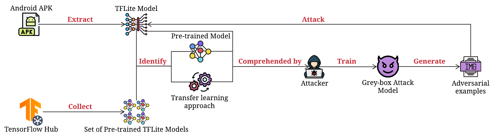
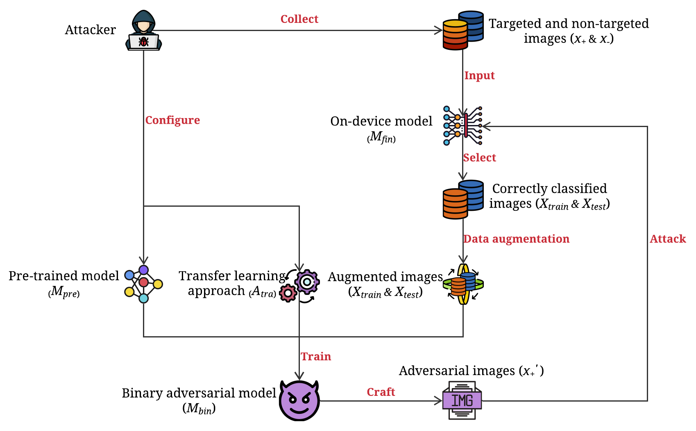

# Smart App Attack: Hacking Deep Learning Models in Android Apps
On-device deep learning is rapidly gaining popularity in mobile applications. Compared to offloading deep learning from smartphones to the cloud, on-device deep learning enables offline model inference while preserving user privacy.

However, such mechanisms inevitably store models on users' smartphones and may invite adversarial attacks as they are accessible to attackers. __Due to the characteristic of the on-device model, most existing adversarial attacks cannot be directly applied for on-device models__.

__In this paper, we introduce a grey-box adversarial attack framework to hack on-device models by crafting highly similar binary classification models based on identified transfer learning approaches and pre-trained models from TensorFlow Hub__. 

We evaluate the attack effectiveness and generality in terms of four different settings including pre-trained models, datasets, transfer learning approaches and adversarial attack algorithms. The results demonstrate that the proposed attacks remain effective regardless of different settings, and significantly outperform state-of-the-art baselines.

We further conduct an empirical study on real-world deep learning mobile apps collected from Google Play. __Among 53 apps adopting transfer learning, we find that 71.7\% of them can be successfully attacked, which includes popular ones in medicine, automation, and finance categories with critical usage scenarios.__ The results call for the awareness and actions of deep learning mobile app developers to secure the on-device models.

## Attack workflow
The framework first performs model extraction to a mobile app with a deep learning model and check if it is a fine-tuned model. By identifying its pre-trained model and corresponding transfer learning approach, the attacker can build a binary classification model (i.e., adversarial model) against the targeted model (i.e., fine-tuned model) to craft adversarial images that fool the targeted model to misclassify a specifically targeted class. The overall workflow of our attack framework is depicted in Fig 1 and the details of training Grey-box Attack Model are depicted in Fig 2.

   
  <em>Fig. 1: The overall workflow of the attack framework.</em>

   
  <em>Fig. 2: Binary adversarial model training and corresponding adversarial images crafting.</em>

## Evaluation
There are four settings that may influence the effectiveness of our attack framework against on-device models including different pre-trained models, datasets, transfer learning approaches and adversarial attack algorithms. To demonstrate the attack success rate and generality, we carry out experiments in all four different settings by specifically targeting at one aspect while keeping the other three aspects the same. For example, when evaluating the performance of our attack in terms of datasets, the selected transfer learning approach, pre-trained model, and adversarial attack are fixed. Note that we adopt the variable control to avoid the explosion of setting combinations.

### Pre-trained models
In experiments, we use three different TensorFlow official pre-trained models including MobileNetV2, InceptionV3 and ResNet50V2 to build our victim fine-tuned models (i.e., on-device models). All the pre-trained models are trained on the ImageNet dataset of 1.3 million images, these models can effectively serve as generic models of the visual world and are capable of transfer learning.

### Datasets
Since most on-device models are commonly used in task domains related to the images, we follow the previous works to select three frequently-used image classification datasets to build the victim fine-tuned models for experiments. The classification tasks associated with these datasets represent typical scenarios developers may face during transfer learning. The datasets are as follows:
- CIFAR-10
- GTSRB
- Oxford Flowers

### Transfer learning approaches
To evaluate the effectiveness of our attack on two transfer learning approaches (_Feature Extraction_ and _Fine-Tuning_), we unfreeze a different number of the top layers (except for the classifier) of a pre-trained model (e.g., MobileNetV2) and jointly train both the newly-added classifier as well as the last unfreezing layers of the base model to build our victim fine-tuned models. These resulting models are able to cover most tuning strategies.
