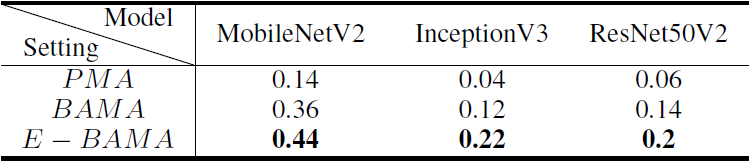
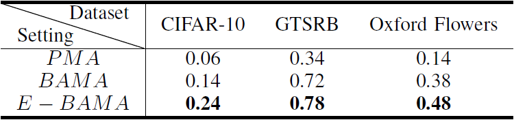
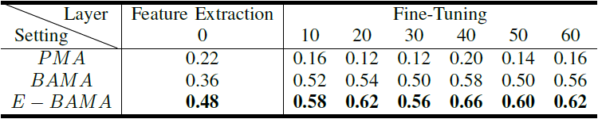
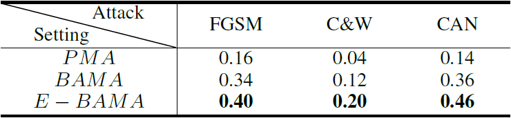
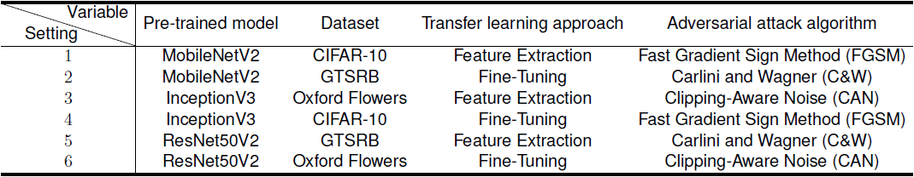
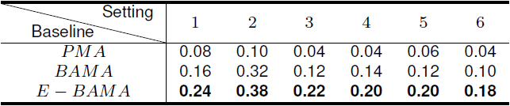

# Smart App Attack: Hacking Deep Learning Models in Android Apps
On-device deep learning is rapidly gaining popularity in mobile applications. Compared to offloading deep learning from smartphones to the cloud, on-device deep learning enables offline model inference while preserving user privacy.

However, such mechanisms inevitably store models on users' smartphones and may invite adversarial attacks as they are accessible to attackers. __Due to the characteristic of the on-device model, most existing adversarial attacks cannot be directly applied for on-device models__.

__In this paper, we introduce a grey-box adversarial attack framework to hack on-device models by crafting highly similar binary classification models based on identified transfer learning approaches and pre-trained models from TensorFlow Hub__. 

We evaluate the attack effectiveness and generality in terms of four different settings including pre-trained models, datasets, transfer learning approaches and adversarial attack algorithms. The results demonstrate that the proposed attacks remain effective regardless of different settings, and significantly outperform state-of-the-art baselines.

We further conduct an empirical study on real-world deep learning mobile apps collected from Google Play. __Among 53 apps adopting transfer learning, we find that 71.7\% of them can be successfully attacked, which includes popular ones in medicine, automation, and finance categories with critical usage scenarios.__ The results call for the awareness and actions of deep learning mobile app developers to secure the on-device models.

## Attack workflow
The framework first performs model extraction to a mobile app with a deep learning model and check if it is a fine-tuned model. By identifying its pre-trained model and corresponding transfer learning approach, the attacker can build a binary classification model (i.e., adversarial model) against the targeted model (i.e., fine-tuned model) to craft adversarial images that fool the targeted model to misclassify a specifically targeted class. The overall workflow of our attack framework is depicted in Fig 1 and the details of training Grey-box Attack Model are depicted in Fig 2.

   
  <em>Fig. 1: The overall workflow of the attack framework.</em>

   
  <em>Fig. 2: Binary adversarial model training and corresponding adversarial images crafting.</em>

## Evaluation
There are four settings that may influence the effectiveness of our attack framework against on-device models including different pre-trained models, datasets, transfer learning approaches and adversarial attack algorithms. To demonstrate the attack success rate and generality, we carry out experiments in all four different settings by specifically targeting at one aspect while keeping the other three aspects the same. For example, when evaluating the performance of our attack in terms of datasets, the selected transfer learning approach, pre-trained model, and adversarial attack are fixed. Note that we adopt the variable control to avoid the explosion of setting combinations.

### Experimental setup

#### Pre-trained models
In experiments, we use three different TensorFlow official pre-trained models including MobileNetV2, InceptionV3 and ResNet50V2 to build our victim fine-tuned models (i.e., on-device models). All the pre-trained models are trained on the ImageNet dataset of 1.3 million images, these models can effectively serve as generic models of the visual world and are capable of transfer learning.
- MobileNetV2
- InceptionV3
- ResNet50V2

#### Datasets
Since most on-device models are commonly used in task domains related to the images, we follow the previous works to select three frequently-used image classification datasets to build the victim fine-tuned models for experiments. The classification tasks associated with these datasets represent typical scenarios developers may face during transfer learning.
- CIFAR-10
- GTSRB
- Oxford Flowers

#### Transfer learning approaches
To evaluate the effectiveness of our attack on two transfer learning approaches (_Feature Extraction_ and _Fine-Tuning_), we unfreeze a different number of the top layers (except for the classifier) of a pre-trained model (e.g., MobileNetV2) and jointly train both the newly-added classifier as well as the last unfreezing layers of the base model to build our victim fine-tuned models. These resulting models are able to cover most tuning strategies.
- _Feature Extraction_
- _Fine-Tuning_

#### Adversarial attack algorithms
For the evaluation of our attack effectiveness against different adversarial attacks, we focus on untargeted attacks in the white-box setting as our attack fools fine-tuned models to misclassify targeted images by constructing adversarial examples on known binary adversarial models. Considering a wide range of white-box untargeted attack algorithms have been proposed, it is unfeasible to cover all of them. We thus select three representative attacks including Fast Gradient Sign Method (FGSM), Carlini and Wagner (C&W), and Clipping-Aware Noise (CAN) attacks for experiments as they are either the basis of many powerful attacks or effective in computer vision tasks.
- FGSM
- C&W
- CAN

#### Baselines
- Default Binary Adversarial Model Attack (BAMA), which crafts adversarial images based on a binary model trained on the targeted class (i.e., the class the attacker intends to force the victim model to misclassify) and non-targeted class (i.e., an arbitrary class recognized by the victim model except for the targeted one).
- Enhanced Binary Adversarial Model Attack (E-BAMA), it is similar to the first setting but substitutes the non-targeted class with the most error-prone class (i.e., the class most likely to be misclassified as the targeted one) during binary model training.
- Pre-trained Model Attack (PMA), which directly generates adversarial images solely based on the victim model's pre-trained model without taking any other model information into account, i.e., it ignores the structure and parameter information of a victim model.

### Effectiveness of the attack
#### Performance on different pre-trained models:

   
  <em>Fig. 3: Attack success rate on Flower Recognition against different pre-trained models.</em>

#### Performance on different datasets:

   
  <em>Fig. 4: Attack success rate of MobileNetV2’s fine-tuned models on various datasets.</em>

#### Performance on different transfer learning approaches:

   
  <em>Fig. 5: Attack success rate of MobileNetV2’s fine-tuned models against different number of fine-tuning layers.</em>

#### Performance on different adversarial attacks:

   
  <em>Fig. 6: Attack success rate of MobileNetV2’s fine-tuned models under different adversarial attack algorithms.</em>

#### Performance on different combinations of the four settings:

   
  <em>Fig. 7: Experiment settings for various combinations of the four settings.</em>

   
  <em>Fig. 8: Attack success rate for various combinations of the four settings.</em>

## Attacking real-world deep learning mobile apps (TensorFlow Lite)

## Attacking real-world deep learning mobile apps (PyTorch Mobile)
